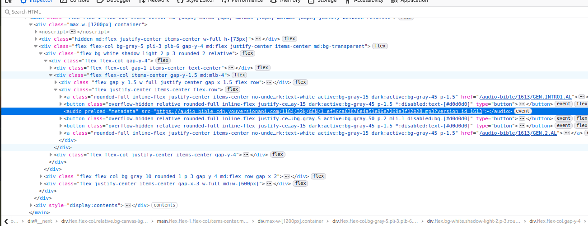

### Exercise 01
  - Write a python script to read the [press_releases_with_img_urls.json](press_releases_with_img_urls.json) file and download all the photos
```bash

  - "image_urls": [
            "https://presidency.gov.gh/wp-content/uploads/2025/11/PHOTO-2025-11-21-15-26-07-3-1024x686.jpg",
            "https://presidency.gov.gh/wp-content/uploads/2025/11/PHOTO-2025-11-21-15-26-07-3.jpg",
            "https://presidency.gov.gh/wp-content/uploads/2025/08/PHOTO-2025-08-27-09-54-44-300x200.jpg",
            ...
  ]
 ```

### Exercise 02 (bible_download FOLDER)
 - Scrape the following audio: 
   - https://www.bible.com/audio-bible/1613/GEN.1.AL, https://www.bible.com/audio-bible/1613/EXO.1.AL
   - https://www.bible.com/audio-bible/1631/GEN.1.AKNA, https://www.bible.com/audio-bible/1631/EXO.1.AKNA
 - First link is Ewe and second link is Akuapim Twi
 - Hint: get all urls to the audio, store in a csv file then write another script to download each audio file


 - 

### Upwork Scraper Jobs


